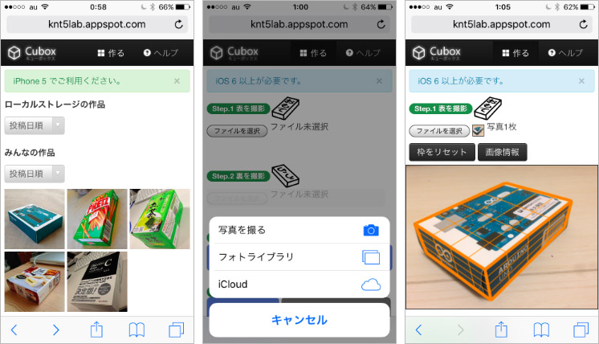
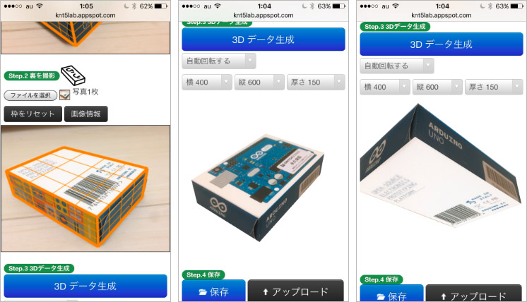

# cubox

JavaScript camera app to make 3D cuboid model from 2 photos without WebGL and any servers' power.

## Documentation

* [Summary (English)](http://knt5lab.appspot.com/software/cubox/pdf/intro-en.pdf)
* [Summary (Japanese)](http://knt5lab.appspot.com/software/cubox/pdf/intro-ja.pdf)
* [Technology description (Japanese)](http://knt5lab.appspot.com/software/cubox/pdf/20130608_BuildersHUB.pdf)

## Demo

http://knt5lab.appspot.com/cubox/

## Screenshots

